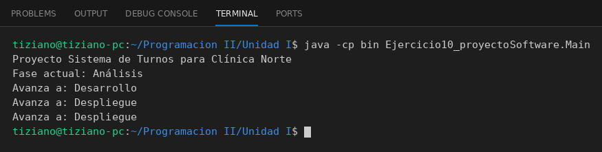

# ProyectoSoftware

Programación II - Unidad 1 - Ejercicio 10

## Consigna
Modelar un proyecto de software corporativo y permitir avanzar su ciclo de vida (1=Análisis, 2=Desarrollo, 3=Despliegue).

## Lógica
- **Atributos (privados):** `nombreProyecto`, `clienteEmpresa` (String) y `faseActual` (int).
- **Constructor:** recibe nombre y cliente, y siempre inicia `faseActual` en 1 (Análisis).
- **`avanzarFase()`:** incrementa la fase en 1 solo si es menor a 3, por lo que nunca pasa de Despliegue.
- **`obtenerEstado()`:** convierte el número de fase en su nombre ("Análisis", "Desarrollo" o "Despliegue").
- **`Main`:** crea un proyecto, avanza tres veces e imprime cada transición (la tercera se queda en Despliegue).

## Ejecución

